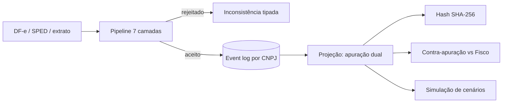
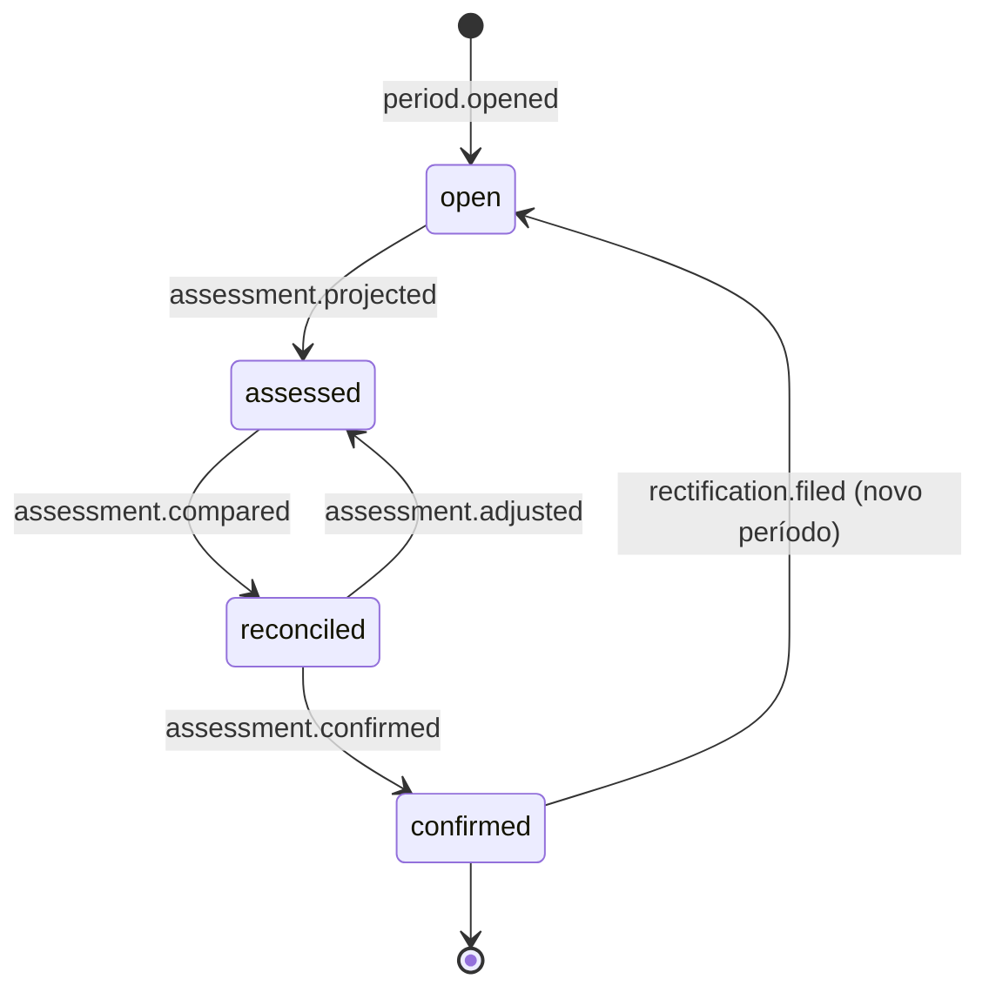

# Briefing de adaptação — `audit` para SaaS fiscal

> **Origem:** documento de produto de 2026-09-17, por @Edilson Rodrigues.
> Transcrição do PDF anexo à sessão de planejamento. Este arquivo é a fonte da
> verdade de produto; decisões de implementação ficam em [`docs/adr/`](../adr/).

## Contexto e tese do produto

O `audit` (ESAA-Flow) vira um motor de conciliação da transição tributária para
escritórios pequenos e médios, cobrado por CNPJ ativo. O kernel de event sourcing
fica; o domínio muda de "agentes de código" para "documentos fiscais e apuração".

A tese em uma frase: durante a convivência dos dois sistemas (2026–2033), o contador
deixa de calcular imposto e passa a auditar o cálculo do Fisco. O produto entrega
três coisas por CNPJ, todo mês: divergências contra a apuração assistida antes do
prazo, crédito em risco por fornecedor e inconsistências velho/novo por item.

**Público:** escritórios com 20 a 300 CNPJs, carteira majoritariamente Simples
Nacional e Lucro Presumido. Esse público não é atendido pelos players enterprise
(Thomson Reuters, e-Auditoria, SAAM) e é subatendido pelos simuladores gratuitos,
que não usam dados reais nem persistem nada.

## Lições dos concorrentes analisados

Cada concorrente ensina uma coisa diferente: UX de simulação, enquadramento
executivo, raiz do erro, especificação da apuração 2027 e modelo comercial.

| Concorrente | O que faz | O que copiar | Onde falha |
|---|---|---|---|
| simuleareforma.com.br | Simulador Simples Integrado × Híbrido × Presumido, 2 atividades, Res. CGSN 190/2026 | Separação custo direto × crédito ao cliente PJ; mapa de sensibilidade alíquota × % crédito; linha do tempo 2027–2033; importação de XML; carteira; memória de cálculo aberta; página de metodologia com o que **não** é modelado | Client-side puro: sem persistência, multiusuário ou trilha de auditoria |
| Sittax | Plataforma modular para escritórios: apuração do Simples, recuperação de créditos, ST/DIFAL, monitor de CNPJs, gestão de certificados | Segregação monofásico/ST por NCM; simulação de Fator R; monitor de CNAE impeditivo e exclusão; cofre de certificados A1 com log de uso; comparação de regimes 2027–2033 por cliente com crédito por fornecedor; modelo "por cima do ERP" (cruza, saneia, devolve); 1 pessoa para ~400 CNPJs/mês | Não faz apuração dual velho/novo por item, contra-apuração contra o Fisco, crédito condicionado ao pagamento nem trilha por hash. Rival direto no Simples; não competir em emissão de DAS |
| Revizia | SaaS de auditoria e compliance fiscal (desde 2016), captura e cruzamento de documentos | 30+ trilhas de auditoria em painel único; Book de Auditorias (15+ verificações que a RFB faz) como entregável; assistente de IA que conversa com os dados fiscais da empresa; monitor de certidões com Registrato BACEN | Foco em empresa média; sem camada de transição velho/novo |
| Inteligência Tributária (AG TaxTech) | Consultoria enterprise, success fee, mira CFO | Tese "impacto está na NCG, não na DRE"; simulador com defasagem em dias, índice de pressão 0–100 e exposição de capital de giro; "Base Espelho" (100% dos XMLs, zero amostragem) | Não é SaaS; inacessível a PME |
| 1WorldSync/Syndigo + Systax | Webinar sobre cadastro de produtos | Tese: o erro nasce no cadastro do item (CST-IBS/CBS × cClassTrib) e contamina a cadeia | Conteúdo, não produto |
| Thomson Reuters ONESOURCE Tax One | Plataforma fiscal enterprise, piloto com Fisco/Serpro | Dashboard contribuinte × Fisco lado a lado, nota a nota; créditos previstos / disponíveis / utilizados; histórico com data, responsável e tipo de ajuste | Enterprise; conciliação e contabilização são módulos pagos à parte |
| OneFlow (Omie) | Sistema contábil para escritórios | Preço por empresa habilitada por regime, mínimo R$ 180, sem fidelidade, calculadora de preço pública, fechamento em lote, drill-down até o documento | Sem camada de reforma |
| Forvis Mazars | Consultoria e BPO fiscal (não é produto) | Posicionamento em contratos e precificação pós-reforma; certificação ISO 27001 como argumento de venda | Nada a incorporar como software |
| GJ IA Contábil | Chatbot de dúvidas contábeis por assinatura, sem dados do cliente | Nada — serve de contraexemplo: assistente genérico compete com ChatGPT | Sem ancoragem nos dados do CNPJ |
| InfoPrice | Calculadora de precificação para varejo | Repasse de preço por item com reduções setoriais | Periférico ao público-alvo |

**Ponto de contraste com o e-Auditoria** (Reclame Aqui, dez/2025–mai/2026): 23 dias
de tempo médio de resposta, cancelamento difícil, cobrança indevida, NCMs
classificados errado. O modelo comercial do OneFlow é a resposta direta a isso.

## Mapeamento ESAA-Flow → domínio fiscal

O kernel `src/esaa/core/` (event-store, projection, validation) não muda. Cada peça
já tem um equivalente fiscal direto.

| ESAA-Flow hoje | Equivalente fiscal |
|---|---|
| Event log append-only (`activity.jsonl`) | Livro de documentos e ajustes: XML recebido, manifestação, ajuste de apuração — tudo evento imutável |
| `ProjectorService` + `HashVerifierService` | Apuração do mês = projeção do log; o hash prova que o número deriva daqueles documentos (trilha de defesa contra a apuração assistida) |
| Pipeline de 7 camadas | 1 parse XML · 2 schema XSD NF-e/NFS-e · 3 vocabulary (tabelas CST, cClassTrib, NCM, CFOP, NBS) · 4 state-machine (ciclo do documento) · 5 boundary (regras do regime do CNPJ) · 6 immutability (período fechado) · 7 verification-gate (Calculadora RFB / apuração do Fisco) |
| `output.rejected` com camada + motivo | Inconsistência fiscal tipada — o erro de mérito que a SEFAZ autoriza mas a apuração pune |
| INV-001 `done` terminal | Período confirmado é imutável; correção só por evento `rectification.filed` em novo período |
| INV-005 single writer | Uma fila de escrita por CNPJ; evita apuração concorrente |
| INV-006 replay determinístico | Reprocessar a carteira inteira quando uma regra muda de vigência |
| Agentes com boundaries | Agentes de classificação e auditoria propõem intenções; nunca escrevem a apuração (argumento de governança para o escritório) |
| Queen / Hive Mind | Fechamento em lote de N CNPJs |
| `HotfixWorkflowService` | Retificação de período fechado |

Leitura: só o pipeline escreve no log; apuração, contra-apuração e simulação são
leituras do mesmo log.

## Bounded contexts novos

Oito contexts em `src/fiscal/`, todos consumindo o kernel `src/esaa/`. Nenhum
escreve no log fora do orquestrador.

| Context | Responsabilidade | Eventos que emite | Depende de |
|---|---|---|---|
| `ingestion/` | Coleta DF-e por CNPJ (distribuição NF-e, NFS-e nacional, CT-e via certificado A1), upload manual, importação de SPED residual (EFD ICMS/IPI, EFD-Contribuições para saldo credor), extrato bancário | `doc.received`, `doc.manifested`, `sped.imported`, `bank.statement.imported` | Certificado do cliente; webservices SEFAZ |
| `catalog/` | Cadastro de itens do cliente versionado por vigência: NCM, NBS, CST-IBS/CBS, cClassTrib, CFOP, CST-ICMS, CST-PIS/Cofins; marcação de monofásico e ST por NCM | `item.classified`, `item.reclassified` | Tabelas oficiais (IT RT 2025.002); tabelas de monofásico/ST |
| `rules/` | Motor de regras com vigência por data: alíquotas de referência, reduções da LC 214, partilha CGSN 190, cronograma ADCT, regimes específicos, Anexos I–V e Fator R | `rule.published` | Fonte RFB / CGIBS; atualização manual auditada |
| `assessment/` | Apuração mensal por CNPJ e regime (Simples integrado, híbrido, Presumido, Real): débitos e créditos velho e novo lado a lado, nota a nota; segregação monofásico/ST; cálculo e projeção do Fator R (pré-requisito do híbrido). **Não emite DAS** | `assessment.projected`, `credit.recognized`, `credit.conditioned`, `credit.released`, `fator_r.projected` | `rules/`, `catalog/`; Calculadora RFB como oráculo (camada 7) |
| `reconciliation/` | Contra-apuração (nossa × Fisco), conciliação fiscal × financeira (crédito condicionado ao pagamento, split), calendário de manifestação; assistente fiscal somente leitura sobre o event log (agente `reconciler`, respostas citam `event_seq`) | `assessment.compared`, `credit.at_risk`, `deadline.approaching` | Plataforma de apuração assistida (formato do piloto RS); `ingestion/` extrato |
| `reporting/` | Trilhas de auditoria nomeadas (agrupamento das issues das 7 camadas) e Book de fechamento por CNPJ/competência em PDF, com hash da projeção e memória de cálculo | `book.generated` | `assessment/`, `reconciliation/` |
| `simulation/` | Cenários Integrado × Híbrido × Presumido, 2027–2033, sensibilidade, NCG/split; roda sobre a projeção com parâmetros alternativos | Nenhum no log de produção (somente leitura) | `assessment/`, `rules/` |
| `portfolio/` | Carteira do escritório: CNPJs, regimes, status de fechamento, tarefas, usuários; cofre de certificados A1 cifrados com cada uso registrado como evento; alertas de CNAE impeditivo e risco de exclusão do Simples | `client.enrolled`, `period.opened`, `period.closed`, `rectification.filed`, `certificate.stored`, `certificate.used`, `client.alert` | Auth multi-tenant |

**Ordem de construção:** `portfolio` → `ingestion` → `catalog` → `rules` →
`assessment` → `reporting` → `reconciliation` → `simulation`. O Book de fechamento
(`reporting`) vem antes da contra-apuração porque é o primeiro entregável que o
escritório consegue vender ao cliente final; o simulador vem por último porque o
Sittax já cobre esse espaço e só vale com dados reais na carteira.

## Vocabulário controlado fiscal e máquina de estados

O vocabulário fiscal vive em `src/fiscal/shared/fiscal-vocabulary.ts` e estende
`esaa-vocabulary.ts`; a camada 3 do pipeline rejeita qualquer ação fora dele.

**Ações de agente** (propostas, passam pelo orquestrador): `item.classify`,
`issue.report`, `assessment.review`, `credit.flag`.

**Ações de orquestrador** (efetivam): `doc.received`, `doc.manifested`,
`item.classified`, `item.reclassified`, `rule.published`, `credit.recognized`,
`credit.conditioned`, `credit.released`, `assessment.projected`,
`assessment.compared`, `assessment.adjusted`, `assessment.confirmed`,
`period.opened`, `period.closed`, `rectification.filed`, `output.rejected`.

**Motivos de rejeição:** `schema_violation`, `unknown_code`, `code_incompatible`
(CST × cClassTrib × NCM), `regime_violation`, `closed_period_violation`,
`fisco_mismatch`, `duplicate_document`, `sequence_gap`.

**Estados do período** (por CNPJ e competência):

`confirmed` é terminal (INV-001). Retificação não reabre o período: emite
`rectification.filed` e abre uma competência de retificação vinculada,
preservando o hash original.

**Estados do crédito:** `expected → conditioned → released` ou
`expected → conditioned → at_risk → lost`. `conditioned` significa documento
válido mas tributo da etapa anterior não liquidado; `released` exige evidência de
pagamento (split ou extrato).

## Agentes e boundaries

Cinco agentes fiscais substituem os dez de engenharia no `AGENT_CONTRACT.yaml`.
A regra continua: só o orquestrador escreve no log.

| Agente | `task_kind` | Ações permitidas | Escreve em | Proibido |
|---|---|---|---|---|
| `collector` | impl | `claim`, `complete` | `ingestion/` (staging de XML) | `.roadmap/`, `assessment/` |
| `classifier` | spec | `item.classify`, `issue.report` | Propostas em `catalog/proposals/` | Confirmar classificação; qualquer apuração |
| `auditor` | qa | `issue.report`, `credit.flag` | Relatórios em `reports/` | Log, catálogo, apuração |
| `reconciler` | review | `assessment.review` | Nada | Tudo (somente leitura) |
| `closer` | orchestrator | `assessment.adjusted`, `assessment.confirmed`, `period.closed` | Log (via orquestrador) | Reclassificar item sem proposta prévia |

Mapeamento com os atuais: `tech-lead` → `closer`; `coder`/`devops` → `collector`;
`architect` → `classifier`; `tester`/`security` → `auditor`; `reviewer` →
`reconciler`. `debugger` → retificação (`HotfixWorkflowService`).

Roteamento de modelo em 3 tiers permanece: WASM para validação de schema e
tabelas; Haiku para classificação de itens em lote; Sonnet/Opus para pareceres de
divergência e simulação de cenários. Queen coordena o fechamento em lote;
consenso Raft garante que dois workers não apurem o mesmo CNPJ.

**O que vender disso ao escritório:** nenhuma IA altera um número fiscal sozinha.
Toda sugestão é uma intenção registrada, revisada e confirmada por humano, com trilha.

## Roadmap de diferenciais (ordem de implementação)

Nove entregas, do mais barato e demonstrável ao mais dependente de integrações
externas. Cada uma vende sozinha. O simulador caiu de posição depois da análise do
Sittax, que já o entrega.

| # | Entrega | Por que é diferencial | Depende de | Alvo |
|---|---|---|---|---|
| 1 | Saúde do cadastro por item, com propagação para notas emitidas; inclui segregação monofásico/ST por NCM | Ataca a raiz (cadastro), não o sintoma (nota); verificadores gratuitos olham um XML por vez | `catalog/`, tabelas oficiais | Nov/2026 |
| 2 | Apuração dual velho/novo por documento, memória de cálculo aberta, hash; Fator R projetado | "Base Espelho" para o pequeno; nenhum concorrente valida ICMS/PIS/Cofins e IBS/CBS no mesmo item | `assessment/`, `rules/` | Dez/2026 |
| 3 | Book de fechamento por CNPJ/competência: trilhas de auditoria nomeadas + hash + memória de cálculo, PDF | Entregável que o escritório manda ao cliente (modelo Revizia); tangibiliza 1 e 2 | `reporting/` | Dez/2026 |
| 4 | Cofre de certificados A1 com cada uso registrado como evento | Quase gratuito no event log; responde à mesma dor do Sittax Token com trilha superior | `portfolio/` | Dez/2026 |
| 5 | Contra-apuração com calendário de prazos | Produto central de 2027: o silêncio vira confissão de dívida; só Thomson Reuters entrega, em escala enterprise | Formato da plataforma de apuração assistida (piloto RS); Calculadora RFB | Jan/2027 |
| 6 | Assistente fiscal somente leitura sobre o event log (agente `reconciler`, cita `event_seq`) | Modelo Revizia, com governança: nunca escreve, sempre cita a evidência | `reconciliation/`, roteamento Sonnet | Fev/2027 |
| 7 | Crédito em risco por fornecedor | Crédito condicionado ao pagamento da etapa anterior; players fiscais não olham o banco | Importação de extrato / open finance; status de split | Mar/2027 |
| 8 | Simulador Integrado × Híbrido × Presumido com dados reais da carteira | Funil de aquisição apenas; Sittax e simuleareforma já cobrem | `simulation/` sobre 1–2 | Antes da janela de mar/2027 (art. 40-D) |
| 9 | Dossiê de saldo credor PIS/Cofins | Upsell Presumido/Real; crédito sem lastro documental será perdido no pente fino | SPED residual em `ingestion/` | 1º sem. 2027 |

**Backlog sem data:** monitor de certidões e DTE/DET (adjacente; avaliar parceria),
checklist de cláusulas de repasse tributário em contratos recorrentes, certificação
de segurança (ISO 27001 ou SOC 2 Type I) como pré-requisito comercial para
custodiar certificados A1.

Os itens 5 e 7 têm risco de dependência externa: o formato de exposição da apuração
assistida ainda está em piloto e o acesso a extratos exige open finance ou upload.
Validar acesso a essas fontes antes de desenhar tela. **Fora do escopo por decisão:**
emissão e transmissão de DAS — território do Sittax e dos ERPs.

## Modelo comercial

Preço público por CNPJ ativo, escalonado por regime, sem fidelidade — o inverso do
que os clientes do e-Auditoria reclamam.

| Regime do CNPJ | Preço/mês (proposta inicial) | O que inclui |
|---|---|---|
| MEI / Simples integrado | R$ 9 | Saúde do cadastro, coleta DF-e, simulador de opção |
| Simples híbrido | R$ 29 | + apuração dual, contra-apuração, calendário |
| Lucro Presumido | R$ 49 | + crédito em risco, dossiê de saldo credor |
| Lucro Real | R$ 89 | Tudo, com SPED completo |

Assinatura mínima R$ 150/mês. Calculadora de preço pública no site, antes de
qualquer contato comercial. Trial de 30 dias com XMLs reais do escritório.
Cancelamento em um clique dentro do produto, sem retenção por telefone.

**Canal:** o escritório de contabilidade. Vender por carteira, nunca por usuário.
Relatório mensal em linguagem de dono de empresa que o escritório repassa ao
cliente final como serviço próprio (white label no plano Presumido para cima).

Os valores acima são **hipótese para teste de preço, não benchmark**: nenhum
concorrente direto publica preço além do OneFlow (mínimo R$ 180, por empresa
habilitada).

## Superfície de API

Contrato em [`docs/api/openapi.yaml`](../api/openapi.yaml): OAS 3.0.3, v0.2.0,
32 rotas, 40 schemas, validado com Redocly. Toda escrita é uma intenção que passa
pelo pipeline; toda resposta de escrita devolve `event_seq` e `projection_hash`.
Rejeições voltam como HTTP 409/422 com `layer`, `reason` e o seq do
`output.rejected` gravado.

| Tag | Rotas | Escreve no log | Observação |
|---|---|---|---|
| `auth` | `POST /auth/login`, `GET /me` | não | JWT; tenant no token |
| `portfolio` | `/clients`, `/clients/{cnpj}`, `/clients/{cnpj}/periods` | sim | `client.enrolled`, `period.opened` |
| `ingestion` | `/documents` (upload multi-arquivo, 207 por arquivo), `/documents/{access_key}`, `/sync`, `/sped`, `/bank-statements`, `/jobs/{id}` | sim | Coleta e importações são jobs assíncronos |
| `catalog` | `/items`, `/items/{id}/classification`, `/items/health` | sim | `item.classified` / `item.reclassified` com vigência |
| `assessment` | `/assessments/{period}` (GET/POST), `/adjustments`, `/confirm` | sim | `confirm` exige o `projection_hash` que o usuário viu; divergência → `verification_mismatch` |
| `reconciliation` | `/reconciliation/{period}`, `/credits/at-risk`, `/deadlines` | sim | Proposta do Fisco entra por upload manual até haver API oficial |
| `reporting` | `/audit-trails`, `/audit-trails/{period}`, `/books/{period}`, `/books/{period}/{id}/download` | sim | `book.generated`; PDF com hash no rodapé; `audience` contador ou dono |
| `certificates` | `/certificate` (GET/PUT/DELETE), `/certificate/usage`, `/certificates/expiring` | sim | PFX nunca sai da API; uso vira `certificate.used` |
| `assistant` | `/assistant/threads`, `/threads/{id}/messages` | não | Agente `reconciler`; `citations[]` com `event_seq`; `suggested_intentions[]` só o usuário executa |
| `simulation` | `POST /simulations` | não | Somente leitura sobre a projeção |
| `events` | `/events`, `/verify` | não | Replay e comparação de hash (INV-006) |

**Decisões do contrato:** certificado saiu do `PATCH /clients/{cnpj}` para endpoint
próprio; nenhuma rota de emissão de DAS; `nullable` exigiu OAS 3.0.3 em vez de 3.1.
Faltam `operationId`s (o gerador do Lovable não exige) e as rotas de retificação
(`rectification.filed`), previstas para a v0.3.

## Pendências técnicas e riscos

O frontend Lovable só destrava com entrypoint e API; tudo o mais vem depois.

- [ ] Criar `src/index.ts` + CLI (`audit serve`, `audit ingest <cnpj>`, `audit close <cnpj> <competencia>`)
- [ ] Camada HTTP implementando `docs/api/openapi.yaml` v0.2.0 (contrato pronto)
- [ ] Confirmar implementação real do lock single-writer (INV-005) e torná-lo por CNPJ, não global
- [ ] Trocar `.roadmap/activity.jsonl` por um store por tenant e CNPJ (`data/<tenant>/<cnpj>/events.jsonl`), mantendo o `JsonlEventStoreRepository` como adapter e preparando um adapter Postgres
- [ ] Preencher `src/application/use-cases/` com os casos de uso fiscais (IngestDocument, ProjectAssessment, CompareWithFisco, ConfirmPeriod)
- [ ] Decidir o resíduo Python: manter isolado só se a Calculadora RFB em execução local exigir; caso contrário, remover `requirements.txt`, `tests/test_setup.py` e `src/__init__.py`
- [ ] Multi-tenancy e autenticação (escritório → usuários → CNPJs)
- [ ] Certificado digital A1 do cliente: armazenamento cifrado e escopo mínimo

| Risco | Impacto | Mitigação |
|---|---|---|
| Regras mudam por portaria (Res. CGIBS 14/2026, CGSN 190/2026 são recentes) | Retrabalho a cada vigência | `rules/` versionado por data + replay determinístico (INV-006) |
| Formato da apuração assistida ainda em piloto | Item 3 do roadmap atrasa | Construir contra-apuração contra a Calculadora RFB primeiro; adaptar ao formato oficial depois |
| ERPs de PME embutem validação básica de cClassTrib em 2027 | Item 1 vira commodity | Diferencial está na propagação, na apuração dual e na relação com o escritório, não na validação isolada |
| Volume de XML por escritório (milhares/mês) | JSONL não escala | Adapter Postgres já previsto; particionar log por CNPJ |
| LGPD e sigilo fiscal | Bloqueio comercial | Dados por tenant, cifragem em repouso, logs de acesso no próprio event log |

## Referências normativas

Base legal para o módulo `rules/`, na ordem em que precisa ser carregada.

| Norma | O que define | Uso no produto |
|---|---|---|
| EC 132/2023 (ADCT art. 124–133) | Cronograma 2026–2033; redução de ICMS/ISS 10%/ano de 2029 a 2032 | Linha do tempo em `rules/` e `simulation/` |
| LC 214/2025 (alterada pela LC 227/2026) | IBS, CBS, IS; art. 31–35 split payment; art. 46 apuração assistida; reduções setoriais | Núcleo de `assessment/` e `reconciliation/` |
| Decreto 12.955/2026 | Regulamento da CBS | Regras federais em `rules/` |
| Resolução CGIBS 6/2026 | Regulamento do IBS (vigência 30/04/2026) | Regras subnacionais em `rules/` |
| Resolução CGIBS 14/2026 | Alíquotas de referência (CBS 9,21% + IBS 0,1% em 2027–2028; ~27,91% pleno) — citadas pelo simuleareforma, **confirmar texto oficial** | Parâmetros default do simulador |
| Resolução CGSN 190/2026 | Partilha CBS+IBS por faixa nos Anexos I–V; art. 40-D janela semestral de opção; art. 40-E vedação de retorno | Simples integrado × híbrido |
| Ato Conjunto RFB/CGIBS 1/2025 | Caráter informativo da apuração em 2026 | Modo "ano-teste" |
| Ato Conjunto RFB/CGIBS 2/2026 | Manual de integração da plataforma de split payment | `reconciliation/` item 4 |
| NT 2025.002 NF-e + IT RT 2025.002 | Leiaute do grupo UB, CST-IBS/CBS, tabela cClassTrib | Camadas 2 e 3 do pipeline |
| Nota Técnica RFB 011/2026 | EFD-Contribuições restrita a retificação e saldos a partir de 2027 | Dossiê de saldo credor |
| Portaria RE 013/2026 (RS) | Piloto da apuração assistida do IBS | Formato de referência para contra-apuração |

**Fontes abertas nesta pesquisa:** Calculadora de Tributos RFB · Apuração assistida ·
Rotina fiscal 2027 · Obrigações acessórias até 2033 · Split payment (TaxUp) ·
Erro sintático × mérito no cClassTrib · Reclame Aqui e-Auditoria.

> ⚠️ Números de norma citados por terceiros (Res. CGIBS 14, Portaria RE 013) **não
> foram conferidos no texto oficial**; confirmar antes de codificar em `rules/`.
